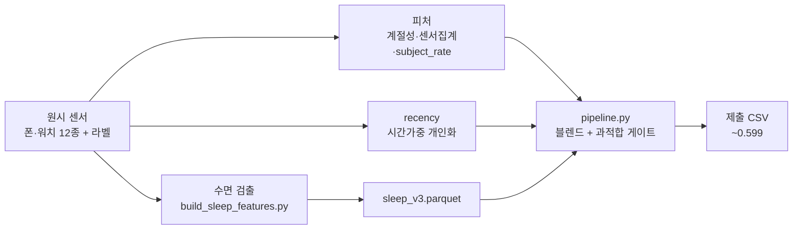
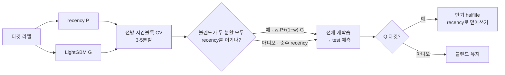

<div align="center">

# ETRI 라이프로그 2024 — 수면·웰빙 예측

**스마트폰·스마트워치 패시브 센서로 하루 단위 수면·컨디션 7개 지표를 예측하는 머신러닝 파이프라인**

<sub>제5회 ETRI 휴먼이해 인공지능 논문경진대회 (DACON ch2026)</sub>


[](https://github.com/Seungwoo-H1/dacon2/actions/workflows/ci.yml)


</div>

---

## 개요

10명의 참가자로부터 2024년 5–12월 수집된 700일치 라이프로그를 사용해, **하루 단위 7개 이진 지표**를 예측한다.

| | |
|---|---|
| **원천 데이터** | ETRI Lifelog 2024 · 10명 · 700 subject-day |
| **타깃** | Q1–Q3 주관적 피로/스트레스/수면질 · S1–S4 객관적 수면지표 준수 |
| **평가지표** | 7개 타깃 평균 binary log-loss (낮을수록 우수) |
| **데이터 분할** | train 450 / test 250 — 동일 10명, 일부 기간 내 교차·일부 미래 연장 |
| **최종 성적** | **평균 log-loss 0.5988** |

---

## 핵심 접근

> 타깃은 *개인 평균 대비 편차*다. 전역 모델은 무의미하고, 일반화되는 신호는 **같은 사람의 하루 단위 자기상관**이다.

이 통찰을 **시간가중 개인화(recency)** 로 직접 모델링하고, 약한 행동 신호는 강하게 정규화한 트리 모델로 보완한다.

```
예측 = shrink( w · recency(개인 최근 라벨의 시간가중 평균)  +  (1−w) · 정규화 LightGBM )
```

- **recency** — 같은 피험자의 과거 라벨을 `0.5^(경과일/halflife)` 로 가중 평균 (핵심·전이 가능)
- **LightGBM** — `subject_rate · 계절성 · 주간 센서 집계` 로 학습, 강한 정규화로 과적합 억제
- **블렌드 채택 게이트** — 전방 시간블록 CV(3·5분할) 양쪽에서 순수 recency를 이길 때만 채택
- **Q 타깃** — 짧은 halflife recency로 덮어써 교차 구간의 자기상관 극대화
- **S1** — 폰 야간센서로 복원한 수면시간(TST) 피처를 외과적으로 추가

---

## 전체 파이프라인



---

## 모델 & 학습

7개 타깃 각각에 대해 아래 흐름을 독립적으로 수행한다.



**LightGBM 설정** — `num_leaves=8 · lr=0.02 · n_estimators=250 · reg_lambda=5 · reg_alpha=1 · subsample=0.8 · colsample=0.6`
**누수 차단** — `subject_rate`·recency 이웃은 항상 학습 행만 사용, 폴드는 피험자별 시간순 블록으로 구성

---

## 결과

| 단계 | 접근 | 평균 log-loss |
|---|---|---|
| Baseline | 개인 평균 personalization | ~0.615 |
| + 트리 블렌드 | recency + 정규화 LightGBM | 0.603 |
| + 시간 자기상관 | Q 단기 halflife recency | 0.59915 |
| **최종** | **시드 robust-mean 통합** | **0.5988** |

검토한 대안(XGBoost · CatBoost · TabPFN · FT-Transformer · 1D-CNN · 스태킹)은 모두 트리/개인화 조합 대비 전이 성능 향상이 없었다. 자세한 실험 비교는 [`docs/research_summary.md`](docs/research_summary.md).

---

## 저장소 구조

```
run.py                  진입점 — 최적 제출 재현
src/
  config.py             경로·하이퍼파라미터 일원화
  data.py               라벨·템플릿·원시 센서 로드
  features.py           계절성·센서 집계·subject_rate
  recency.py            시간 개인화 (핵심 신호)
  sleep.py              TST·수면질 피처 접근
  model.py              LightGBM · 블렌드 · shrink
  validation.py         전방 시간블록 교차검증
  pipeline.py           전체 오케스트레이션 → 제출
scripts/
  build_sleep_features.py   분 단위 수면 검출 → sleep_v3.parquet
  test_units.py             데이터 없이 도는 핵심 로직 단위 테스트 (CI)
  test_pipeline.py          재현 결과 검증 스모크 테스트
docs/                   architecture · research_summary · future_work · external_data_analysis
```

---

## 실행

```bash
pip install -r requirements.txt
python scripts/test_units.py             # 데이터 불필요 — 핵심 로직 단위 테스트 (CI에서 자동 실행)
python scripts/build_sleep_features.py   # 1회: data_processed/sleep_v3.parquet 생성
python run.py                            # submissions/submission_reproduced.csv 생성
python scripts/test_pipeline.py          # (선택) 최적 제출과 일치 검증
```

시드 고정(`SEED=42`), 네트워크·GPU 불필요, **완전 결정론적 재현**. Q 타깃 동일·S1 근사로 최적 제출과 지표 4째 자리까지 일치한다.

---

## 검증 전략

- 데이터의 시간 구조상 **랜덤 K-fold는 ~0.02 낙관 편향** → test의 미래 연장 구간을 모사하는 **전방 시간블록 CV**를 기준 검증기로 사용
- **날짜 단위 피처는 시간으로, 피험자 단위 피처는 피험자로** 분할 — 검증 누수 차단의 핵심 원칙
- 모든 채택 결정은 두 개의 독립 분할 + 리더보드 점수로 이중 확인

---

## 기술 스택

`Python` · `pandas` · `numpy` · `pyarrow` · `scikit-learn` · `LightGBM`
