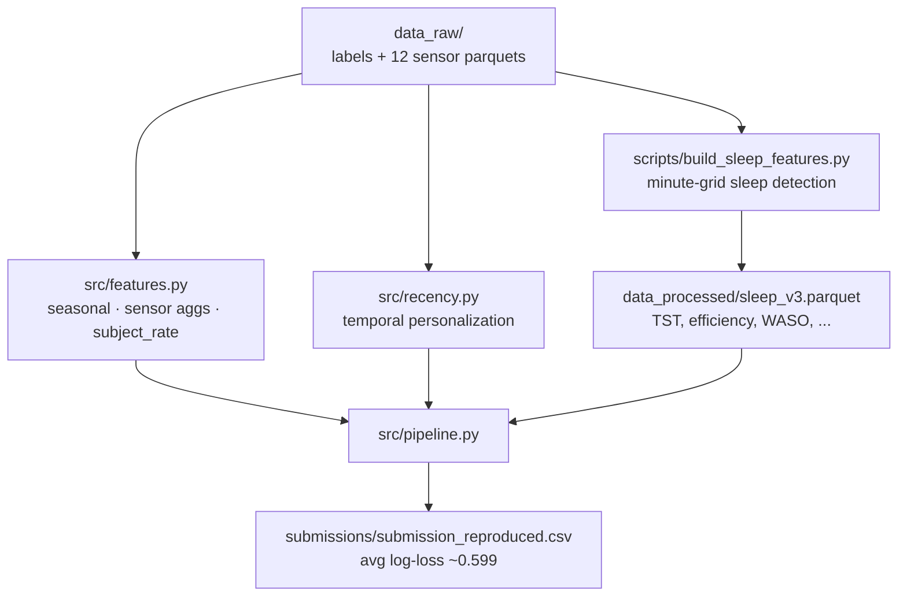
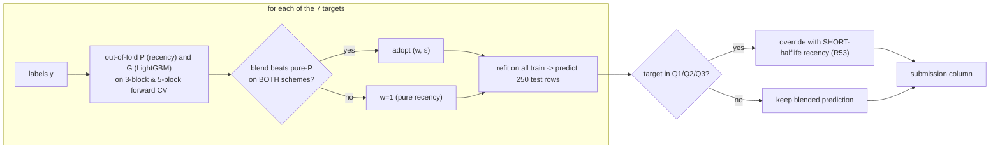
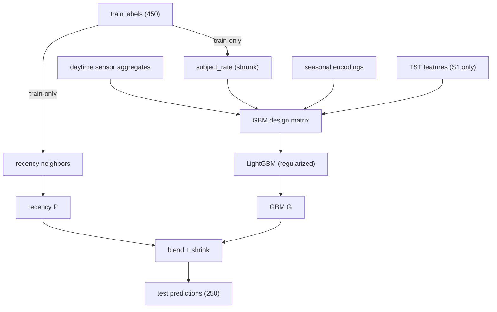
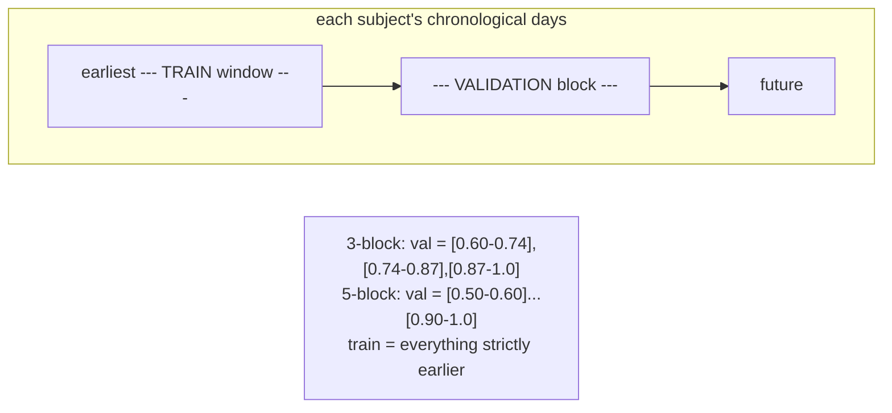
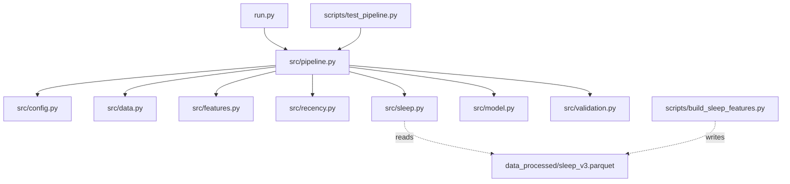
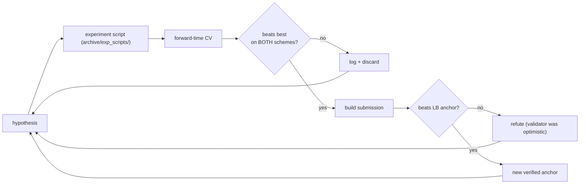

# Architecture

All diagrams are GitHub-flavored Mermaid and render directly in the web UI.

## 1. Overall pipeline

## 2. Per-target training & inference

## 3. Data flow (train vs test, leakage boundaries)

## 4. Forward (time-blocked) validation

## 5. Repository architecture

## 6. Experiment workflow (how the research loop ran)

